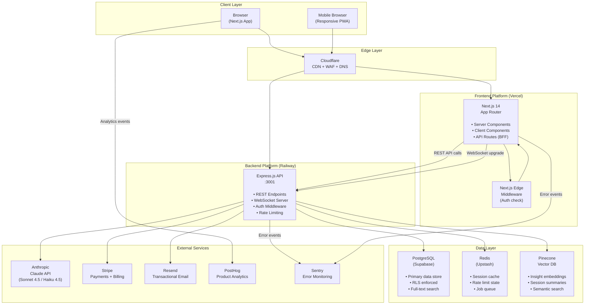
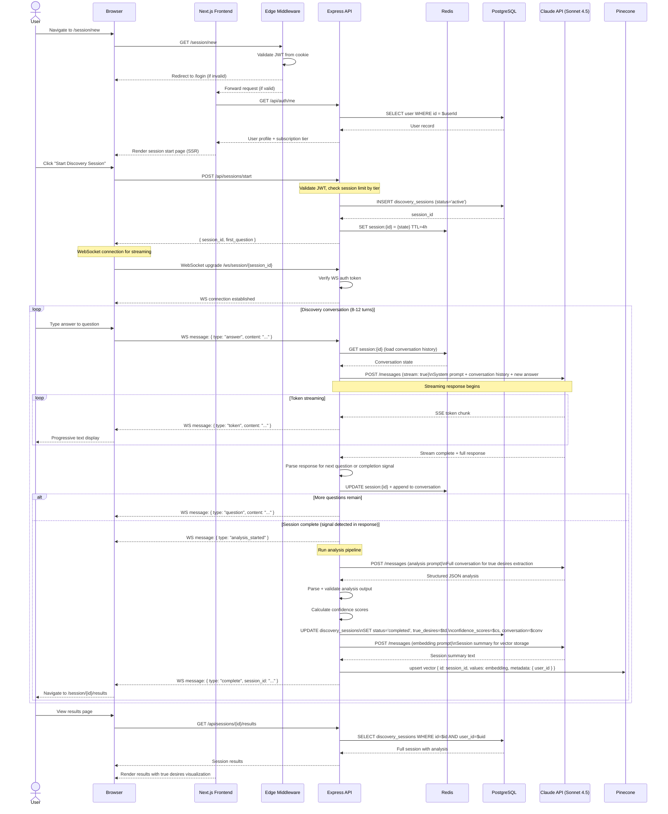
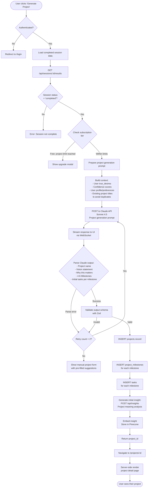
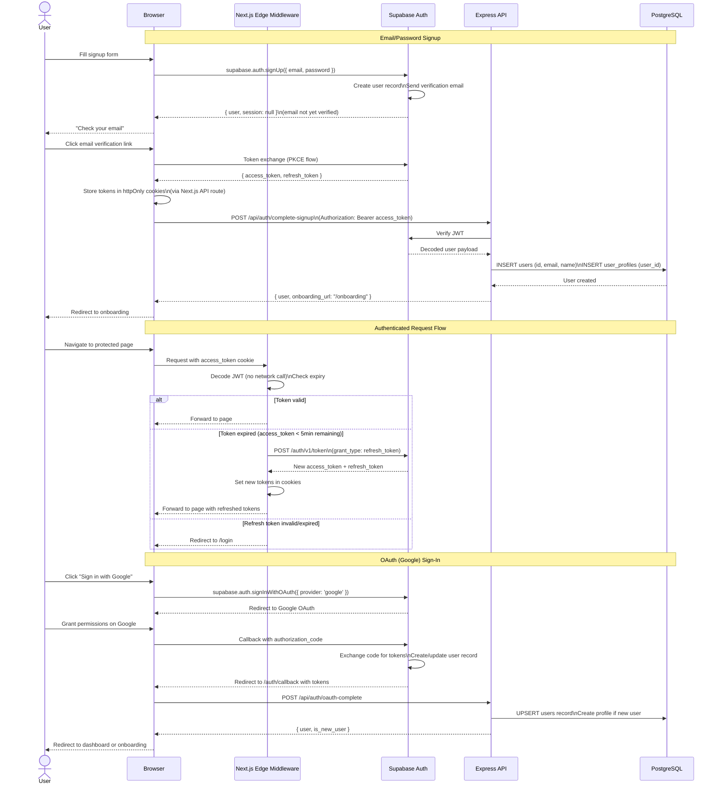
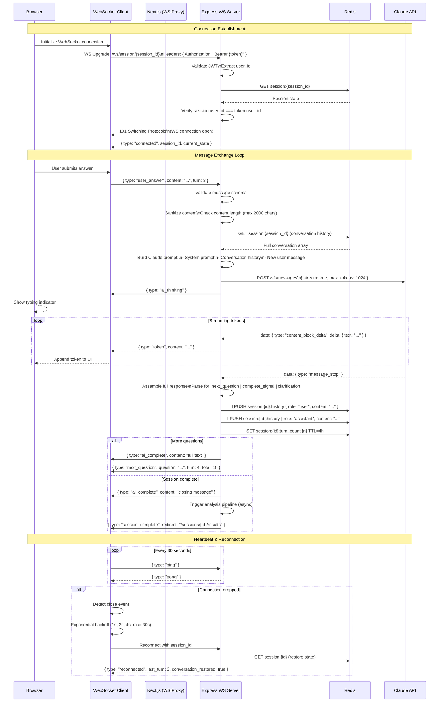

# Source Constructor (SOC) — System Architecture

**Document Version:** 1.0
**Last Updated:** 2026-03-02
**Status:** Approved
**Owner:** Engineering Lead

---

## Overview

This document describes the complete system architecture of the Source Constructor (SOC) platform. It covers the high-level component topology, detailed data flows for core user journeys, architecture decision records (ADRs), scalability planning, caching strategy, and error handling approach.

SOC follows a **modular monolith** backend architecture deployed as a single service, with clear domain boundaries that allow future extraction into microservices if required. The frontend is a **server-rendered React application** using Next.js 14 App Router. All services communicate over HTTPS, with WebSocket connections used exclusively for real-time AI response streaming.

---

## 1. High-Level System Architecture



### Component Responsibilities

| Component | Responsibility | Technology |
|-----------|---------------|------------|
| Cloudflare | CDN caching, DDoS protection, WAF, DNS | Cloudflare Pro |
| Next.js (Vercel) | SSR/SSG pages, client-side routing, BFF API routes | Next.js 14, Vercel |
| Edge Middleware | Route protection, auth token validation at edge | Next.js Edge Runtime |
| Express API | Business logic, AI orchestration, data access | Node.js 20, Express 4 |
| PostgreSQL | Persistent relational data, RLS-enforced isolation | Supabase managed PG |
| Redis | Caching, rate limiting, lightweight job queue | Upstash serverless Redis |
| Pinecone | Vector similarity search for insight retrieval | Pinecone managed |
| Claude API | AI response generation, analysis, embeddings | Anthropic API |

---

## 2. Discovery Session Data Flow

This diagram shows the complete sequence of events when a user conducts a Discovery Session — the core product experience.



---

## 3. Project Generation Flow



---

## 4. Authentication Flow



---

## 5. Real-Time WebSocket Flow (Chat)



---

## 6. Architecture Decision Records (ADRs)

### ADR-001: Monolith Backend vs Microservices

**Status:** Accepted

**Context:** Initial architecture decision on how to structure the backend. Options were: (a) monolithic Express app, (b) microservices (Auth Service, AI Service, Project Service), (c) serverless functions.

**Decision:** Monolithic Express application with clear domain separation (controllers, services, repositories by domain).

**Rationale:**
- SOC is a new product with evolving requirements; microservice boundaries are hard to define correctly before the domain is well-understood
- Monolith-first reduces operational complexity, eliminates inter-service network latency, and simplifies deployment
- Domain separation within the monolith allows extraction into services when specific scaling bottlenecks emerge
- WebSocket connections require persistent server state; serverless functions cannot maintain WebSocket connections without additional infrastructure (e.g., socket adapters)

**Consequences:** Accept potential future refactoring cost if specific services need independent scaling. Mitigated by clear module boundaries from day one.

---

### ADR-002: Supabase Auth vs Custom JWT Auth

**Status:** Accepted

**Context:** Building custom JWT auth (bcrypt passwords, refresh token rotation, OAuth) vs. using Supabase Auth as a managed service.

**Decision:** Supabase Auth for all authentication.

**Rationale:**
- Auth is a solved problem with high security stakes; custom implementations frequently contain vulnerabilities
- Supabase Auth provides: bcrypt password hashing, secure refresh token rotation, PKCE OAuth flows, magic link, MFA support
- Supabase RLS policies integrate natively with Supabase Auth user IDs, providing seamless data isolation
- Time savings estimated at 2–3 weeks of engineering time

**Consequences:** Dependency on Supabase for auth availability. Supabase's 99.9% uptime SLA is acceptable. Migration path documented if needed.

---

### ADR-003: REST vs GraphQL

**Status:** Accepted

**Context:** API communication protocol between frontend and backend.

**Decision:** RESTful API with JSON payloads.

**Rationale:**
- SOC's data requirements are well-defined and do not require flexible ad-hoc querying (GraphQL's primary advantage)
- REST endpoints are simpler to implement, document, test, and secure
- HTTP caching is straightforward with REST; GraphQL's POST-based queries cannot be CDN-cached
- Rate limiting per endpoint is simpler with REST
- Future mobile clients (iOS, Android) work naturally with REST

**Consequences:** Some over-fetching in list endpoints. Mitigated with response field filtering via `?fields=` query parameter on high-traffic endpoints.

---

### ADR-004: WebSockets vs Server-Sent Events for AI Streaming

**Status:** Accepted

**Context:** Real-time AI token streaming mechanism.

**Decision:** Native WebSockets (`ws` library) over Server-Sent Events (SSE).

**Rationale:**
- SOC's session protocol is bidirectional (client sends answers, server streams AI responses); SSE is unidirectional (server → client only)
- WebSockets enable future features: collaborative sessions, real-time accountability pair notifications
- `ws` library is lightweight and well-maintained without the overhead of Socket.IO
- WebSocket connections are maintained on Railway's persistent server environment (not serverless)

**Consequences:** WebSocket state must be handled carefully with reconnection logic. Addressed in the connection management layer with Redis-backed state persistence.

---

### ADR-005: Pinecone vs pgvector for Vector Storage

**Status:** Accepted

**Context:** Vector similarity search for insight retrieval and long-term user memory.

**Decision:** Pinecone for vector storage, with pgvector as a future migration option.

**Rationale:**
- Pinecone provides a fully managed, dedicated vector index optimized for ANN (Approximate Nearest Neighbor) search
- pgvector requires careful index tuning (HNSW parameters) and dedicated Postgres resources to maintain query performance at high vector counts
- Pinecone's metadata filtering by `user_id` is straightforward and performant
- At SOC's scale (~10k users, ~500k vectors), Pinecone's Standard plan is cost-effective

**Consequences:** Additional service dependency. Pinecone's free tier limitations require plan upgrade at scale. Migration to pgvector documented as a future cost optimization path.

---

## 7. Scalability Plan

### Current State (0–1,000 users)
- Single Express.js instance on Railway (1 vCPU, 2GB RAM)
- Single Supabase project (Free → Pro as needed)
- Single Upstash Redis instance
- Pinecone Free tier (1 index)
- All services in same Railway project

### Phase 1: Early Growth (1,000–10,000 users)
**Trigger:** API response times consistently above 200ms P95, or CPU usage above 70% sustained

**Actions:**
- Scale Railway instance to 2 vCPU, 4GB RAM
- Enable Railway horizontal scaling (2 replicas) with sticky WebSocket sessions (session affinity by `session_id` hash)
- Upgrade Supabase to Pro ($25/month); enable connection pooling via PgBouncer
- Implement Redis-based response caching for frequently accessed endpoints (`GET /api/projects`, `GET /api/insights`)
- Upgrade Pinecone to Standard plan

**Expected capacity:** 10k active users, 500 concurrent WebSocket connections

### Phase 2: Scaling (10,000–50,000 users)
**Trigger:** Database CPU consistently above 60%, or query P95 above 100ms

**Actions:**
- Introduce read replica in Supabase for read-heavy queries (project lists, insights, check-in history)
- Separate WebSocket server from REST API server; deploy WebSocket service as dedicated Railway service
- Implement API response caching at Cloudflare edge for public/shared endpoints
- Extract AI orchestration into dedicated service with its own scaling profile
- Implement database query result caching (Redis) for expensive aggregations (streak counts, mood averages)
- Introduce message queue (Redis Streams or dedicated Bull queue) for async operations (email sending, insight generation, embedding updates)

**Expected capacity:** 50k active users, 2,500 concurrent WebSocket connections

### Phase 3: Enterprise Scale (50,000–100,000 users)
**Trigger:** Infrastructure costs approach $5,000/month or performance degradation in specific regions

**Actions:**
- Evaluate self-hosted PostgreSQL vs. Supabase Team plan
- Multi-region deployment: primary in US-East, replica in EU-West (GDPR compliance) and Asia-Pacific
- Implement global load balancing via Cloudflare Workers
- Consider extracting to microservices: Auth Service, AI Orchestration Service, Notification Service
- Implement CDN-level API response caching for non-personalized content
- Redis Cluster for distributed caching across regions
- Evaluate replacing Pinecone with self-hosted Weaviate or Qdrant at cost threshold

**Expected capacity:** 100k active users, 10,000 concurrent WebSocket connections

---

## 8. Caching Strategy

### Cache Layers

| Layer | Technology | TTL | Scope | Purpose |
|-------|-----------|-----|-------|---------|
| Browser | HTTP Cache-Control | Varies | Per user | Static assets, immutable files |
| CDN (Cloudflare) | Cache API | 1hr–24hr | Global | Marketing pages, static assets |
| Next.js | `next/cache` | 5min–1hr | Per route | Server component data fetching |
| Application (Redis) | Upstash | 30min–4hr | Per user | Session state, user data |
| Database query | PgBouncer | N/A | Connection pool | Connection reuse |

### Cache Key Design

```
user:{user_id}:profile          — User profile data, TTL 1hr
user:{user_id}:projects         — Project list, TTL 30min
user:{user_id}:streak           — Current streak, TTL 1hr
session:{session_id}            — Active session state, TTL 4hr
session:{session_id}:history    — Conversation history list, TTL 4hr
insights:{user_id}:recent       — Recent insights list, TTL 2hr
rate_limit:{ip}:{endpoint}      — Rate limit counter, TTL per policy
```

### Cache Invalidation Rules

- **User profile:** Invalidate on `PUT /api/users/profile`
- **Project list:** Invalidate on project CREATE, UPDATE, DELETE
- **Session state:** Invalidate on session COMPLETE or ABANDON
- **Streak:** Invalidate on check-in submission
- **Insights:** Invalidate on new insight generation

### AI Prompt Caching

Static portions of system prompts (persona definition, output format instructions) are stored in Redis with a 24-hour TTL. Only the dynamic portions (conversation history, user-specific context) are assembled per request, reducing per-request prompt construction time by ~30ms.

---

## 9. Error Handling Approach

### Error Classification

```
1. User Errors (4xx)       — Invalid input, unauthorized, not found
2. External Service Errors — Claude API unavailable, Stripe webhook failure
3. Infrastructure Errors   — Database connection lost, Redis timeout
4. Application Bugs        — Unexpected null, type mismatch
```

### Error Response Format

All API errors return a consistent JSON structure:

```json
{
  "error": {
    "code": "VALIDATION_ERROR",
    "message": "Answer content must not exceed 2000 characters.",
    "details": [
      {
        "field": "content",
        "issue": "String must contain at most 2000 character(s)"
      }
    ],
    "request_id": "req_01HX..."
  }
}
```

### Error Codes

| Code | HTTP Status | Description |
|------|-------------|-------------|
| `VALIDATION_ERROR` | 400 | Request body failed schema validation |
| `UNAUTHORIZED` | 401 | Missing or invalid authentication token |
| `FORBIDDEN` | 403 | Authenticated but lacks permission |
| `NOT_FOUND` | 404 | Resource does not exist or belongs to another user |
| `RATE_LIMITED` | 429 | Too many requests; Retry-After header included |
| `TIER_LIMIT` | 403 | Feature not available on current subscription tier |
| `SESSION_EXPIRED` | 410 | Discovery session has expired (>4 hours since last activity) |
| `AI_UNAVAILABLE` | 503 | Claude API is unreachable; retry with backoff |
| `INTERNAL_ERROR` | 500 | Unexpected server error; logged to Sentry |

### Retry and Circuit Breaker Strategy

**Claude API calls:**
- Retry on 529 (overloaded) and 5xx errors: 3 attempts, exponential backoff (1s, 2s, 4s)
- Circuit breaker: open after 5 consecutive failures within 60 seconds
- Fallback: queue the operation for retry, return a graceful degraded response to the user
- If circuit open: return cached response if available, otherwise `AI_UNAVAILABLE` error

**Database operations:**
- Connection pool via PgBouncer handles transient connection failures
- Retry on `ECONNRESET`, `ECONNREFUSED`: 2 attempts, 500ms delay
- All mutations wrapped in try/catch with explicit rollback

**Redis operations:**
- Redis failures are non-blocking for read operations (fail open, read from database)
- Redis failures for write operations (rate limit) are logged but do not block requests (conservative: allow the request)

### Frontend Error Boundaries

```
Root Error Boundary    — catches all uncaught errors, shows global error page
├── Layout Boundary    — isolates navigation from content errors
├── Dashboard Boundary — catches dashboard widget errors independently
├── Session Boundary   — catches session-specific errors
└── Project Boundary   — catches project view errors
```

Each boundary reports to Sentry and shows a contextual recovery UI ("Something went wrong — [Try Again] or [Go to Dashboard]").

### WebSocket Error Handling

- Connection errors → automatic reconnection with exponential backoff (max 5 attempts)
- Message parse errors → log to Sentry, send `{ type: "error", code: "PARSE_ERROR" }` to client
- Claude API error during streaming → send `{ type: "error", code: "AI_ERROR", recovery: "retry" }` to client
- Session state corruption → restore from PostgreSQL (Redis as secondary), notify user of minor delay

---

*Architecture diagrams should be regenerated whenever significant topology changes are made. Use Mermaid Live Editor (mermaid.live) to preview diagram changes before committing.*
